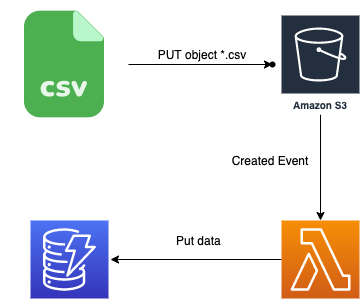

# Containerized and Serverless App

[](https://travis-ci.org/joemccann/dillinger)

This repository composed of two main folder which are mapping each tasks such as containerizad-app and serverless-app.
Serverless-app include dummy AWS credentials, you can easliy test it locally. Terraform validate and plan is also sutiable for this project. However, terraform apply and destroy no need.

 ## IMPORTANT NOTE
  ECR repository does not exist at the beginig of project. If you want to push your image in AWS ECR, you should run containerized-app terraform code which will create ECR and ECS cluster. ECR name is "containerized-app", after sucessfully creation of terraform apply, you can run "2-ecr-publish" job.

## Tech
This repository is using different technology work properly:

- ✨Terraform
- ✨Docker
- ✨AWS
- ✨Bash  Scripting
- ✨Python
 
## Installation

For installation part of CI/CD image is using stage related(which means terraform job is using hashicorp/terraform:1.0.0) image for environment. Images are alpine,terraform,hadolint,docker and awscli with some customized solution and work-around. To run pipeline correctly please define environment variables.

For production environments variables...

```sh
AWS_ACCESS_KEY_ID
AWS_ACCOUNT_ID
AWS_DEFAULT_REGION
AWS_SECRET_ACCESS_KEY
```

## CI/CD
These project includes 6 stages which are described below:
  - lint : Docker file check and lint by using Hadolint
  - publish : Publish docker image of containerzed project GITLAB registry and AWS ECR
  - terraform-validate: Validate terraform code.
  - terraform-plan: Init and plan terraform code
  - terraform-apply: Apply terraform code
  - terraform-destroy: Destroy resources in AWS.


## TEST
For serverless app , it offers local test environment. Below described steps show how to test serverless app locally. Aws cli, terraform and docker should be installed in local environment. After test script is compeleted. You can check test_output folder.
  
- ✨Terraform = v1.0.0
- ✨Docker   = 19.03.13
- ✨AWS CLI =   aws-cli/2.0.54 
- ✨LocalStack 


Before run script AWS_SECRET_ACCESS_KEY, AWS_ACCESS_KEY_ID and AWS_REGION should be defined.
```sh
export AWS_SECRET_ACCESS_KEY="test"
export AWS_ACCESS_KEY_ID="test"
export AWS_DEFAULT_REGION= "us-east-1"
```
Alternatively, AWS_SECRET_ACCESS_KEY="test", AWS_ACCESS_KEY_ID="test" and AWS_DEFAULT_REGION= "us-east-1" should be defined with these values inside below comment.

```sh
aws configure
```

```sh
git clone git@gitlab.com:ardasendur/assignment.git
cd /serverless-app/terraform/aws/test
bash test.sh <PATH_OF_CSV_FILE>
cd test_output
```
## DIAGRAM

- ✨CI/CD Pipeline


- ✨Containerized-APP


- ✨Serverless-APP



